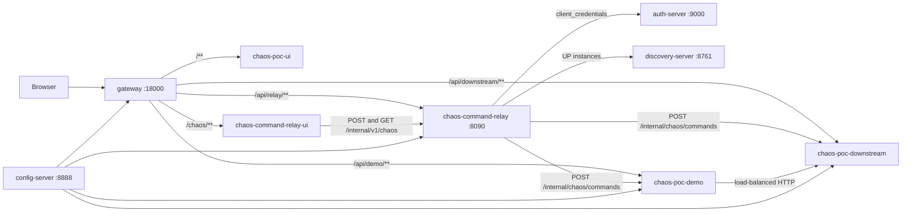
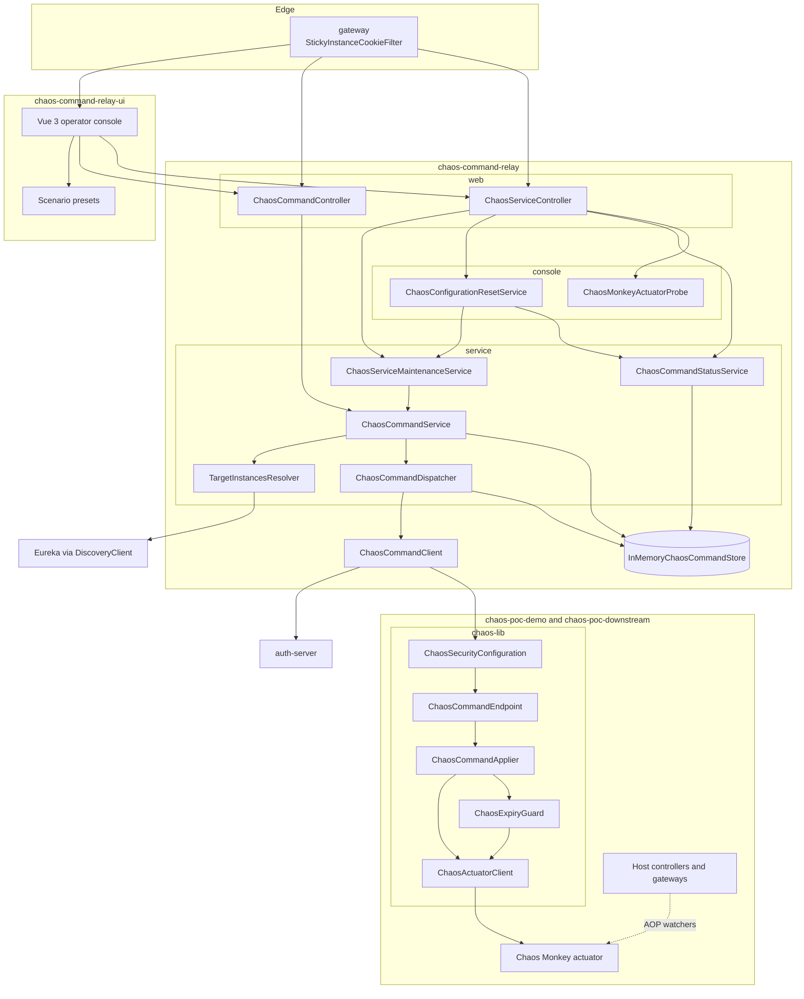
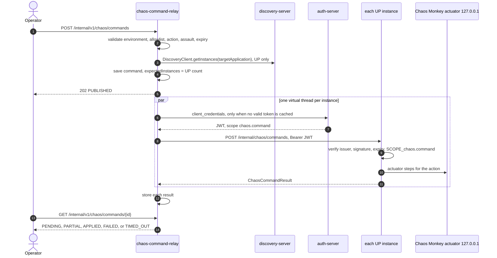
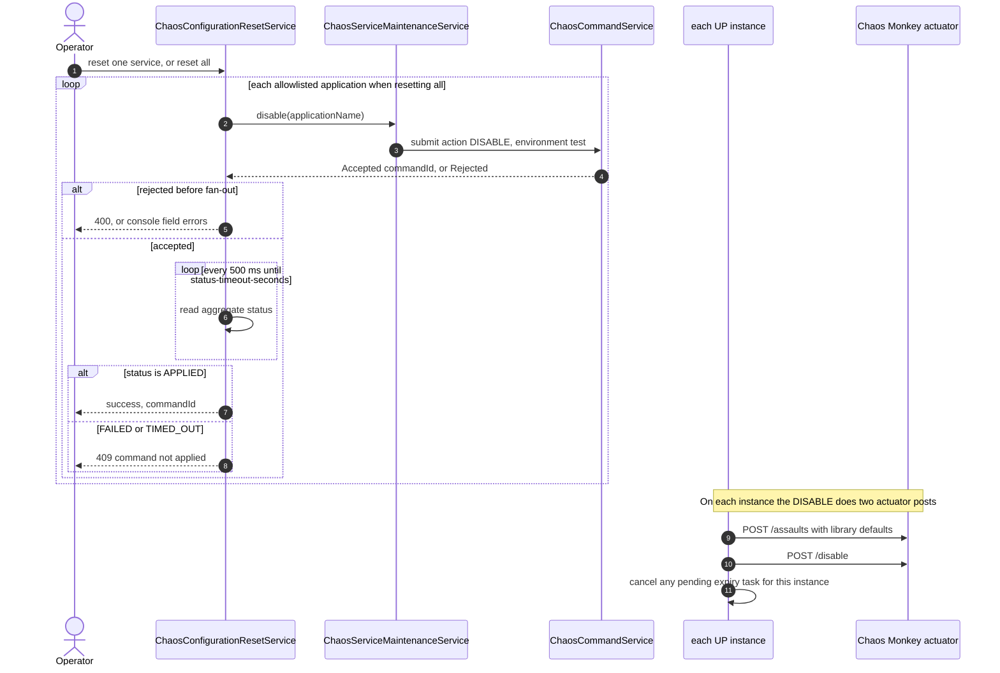

# Chaos POC — High-Level Architecture

**Status:** As-built (0.2.0)
**Audience:** Engineers working in this repository
**Date:** 2026-10-06

This document describes how the local Chaos Monkey platform is wired, how one command reaches every live instance, and how an operator restores the default Chaos Monkey configuration. Contracts, config keys, and the full scenario catalog stay in [CHAOS_COMMAND_RELAY_APPROACH.md](CHAOS_COMMAND_RELAY_APPROACH.md). Additional sequence diagrams (token lifecycle, aggregation rules, assault, lease expiry) stay in [CHAOS_SCENARIO_SEQUENCES.md](CHAOS_SCENARIO_SEQUENCES.md).

## 1. Purpose and scope

The platform lets an operator apply one Chaos Monkey command to every UP instance of a named service, then read a per-instance result and an aggregate status.

In scope:

- Compose topology: gateway, Eureka, config server, local authorization server, relay, operator console, demo, downstream, verify UI.
- The submit path from console or HTTP API through discovery and chaos-lib to the loopback actuator.
- The reset path that disables Chaos Monkey and writes the library default assault.

Out of scope:

- Production identity. `auth-server` stands in for the platform identity provider.
- Kubernetes EndpointSlices. The relay already calls `DiscoveryClient`; a cluster registry can replace Eureka without changing that call.

## 2. System context

Traffic from a browser enters the Spring Cloud Gateway. The gateway load-balances application routes through Eureka. The relay does not sit on the request path of demo or downstream calls. It discovers the same registry and pushes commands to each instance.

`prefer-ip-address: true` is required on every registered service. Eureka then advertises the container address, and the relay posts to that address instead of a shared DNS name.

Runtime settings live in `config-repo/` and are served by the config server. nginx serves two static frontends: `chaos-poc-ui` (verify) and `chaos-command-relay-ui` (Vue 3 operator console). The console calls the relay through `/api/relay/**`.

## 3. Architecture principles

| Principle | What it means here |
| --- | --- |
| Registry is the instance list | The relay and the gateway both use Eureka. There is no static URL map. |
| Push, then store the HTTP result | The relay POSTs the command. The response body is that instance's `ChaosCommandResult`. There is no broker. |
| Short-lived service token | The relay obtains a `client_credentials` JWT (scope `chaos.command`, 5 minutes) and sends it as `Authorization: Bearer`. |
| Actuator stays on loopback | chaos-lib calls Chaos Monkey at `127.0.0.1`. Callers never post the actuator from outside the instance. |
| One command, selected UP instances | `instanceSelection` is `ALL` (every UP instance) or `SOME` (named discovery ids). `expectedInstances` is that selected count. An empty registry is `503` `NO_INSTANCES`. |

## 4. Component view

The command path is the Vue operator console, the relay, and chaos-lib inside each target instance. Demo and downstream both embed the same chaos-lib components, so the diagram shows that library once. Scenario presets live in the console. The relay only accepts the command API.

Arrows are in-process calls except the four that leave the relay: `TargetInstancesResolver` reads Eureka, `ChaosCommandClient` fetches a token from `auth-server`, and that same client POSTs `/internal/chaos/commands` into chaos-lib. The dotted line is Chaos Monkey's aspect on host beans such as `InventoryGateway` and `AuthorizationGateway`. It is the assault path, separate from command delivery. `InMemoryChaosCommandStore` lives only in the relay process.

| Component | Responsibility | Technology |
| --- | --- | --- |
| `gateway` | Edge routes and sticky instance cookie (`sc-lb-instance-id`) | Spring Cloud Gateway |
| `discovery-server` | Service registry | Eureka |
| `config-server` | Runtime YAML from `config-repo/` | Spring Cloud Config, native backend |
| `auth-server` | Issues relay JWTs. Signing key is generated at startup | Spring Authorization Server |
| `chaos-command-relay-ui` | Operator console: scenarios, publish, history, reset | Vue 3, Vite, nginx |
| `chaos-command-relay` | Validate, discover, fan out, aggregate | Spring Boot, OpenFeign |
| `chaos-lib` | Authorize `POST /internal/chaos/commands` and drive the actuator | Auto-configuration, OAuth2 resource server |
| `chaos-poc-demo` | Order API and Chaos Monkey target | Spring Boot |
| `chaos-poc-downstream` | Inventory and authorization target | Spring Boot |
| `chaos-poc-ui` | Static verify UI | nginx, React |

Packages follow the same layers in each module: `config`, `web`, `service`, and where the module needs them `client`, `model`, `store`, `repository`, `command`, and `exception`. `ChaosAutoConfiguration` stays in `com.samba.chaos` so component scan covers the library subpackages. Relay classes that probe the actuator or reset configuration stay in `com.samba.chaos.relay.console` because the API uses them. The browser UI does not.

chaos-lib is active when the profile is `test` or `chaos-monkey` and `samba.chaos.command.enabled=true`. Its security filter chain matches only `/internal/chaos/**`. Each host declares its own chain for the rest of its routes.

## 5. Apply a command

The operator console and any other client call the same relay API. `ChaosCommandService.submit` is the only submit path:

| Entry | Request | Response |
| --- | --- | --- |
| Operator console | Browser `POST /api/relay/internal/v1/chaos/commands`. The Vue app loads the preset, sets a two-hour lease, and shows field errors on `/chaos` | Navigates to `/chaos/commands/{id}` after **202** |
| Relay API | `POST /internal/v1/chaos/commands` | **202** with `PUBLISHED` and a status URL. Validation failure is **400**. No UP instances is **503** |

The console preset sets `expiresAt` before submit. The API caller supplies `expiresAt` when the action is `ENABLE` or `CONFIGURE_AND_ENABLE`. The status page polls `GET /internal/v1/chaos/commands/{id}` through the gateway.

The relay returns before fan-out finishes. Status is computed on each read, in this order: any non-`SUCCESS` result is `FAILED`; every expected instance `SUCCESS` is `APPLIED`; a closed status window (`status-timeout-seconds`, default 30) is `TIMED_OUT`; zero reports is `PENDING`; otherwise `PARTIAL`.

On the instance, `ChaosActuatorClient.apply` stops at the first failed step. `503`, `504`, and connection failures retry. Other HTTP statuses become `ACTUATOR_ERROR`.

| Action | Actuator steps |
| --- | --- |
| `CONFIGURE` | Reset assaults to defaults, then post the scenario assault |
| `ENABLE` | `POST /enable` |
| `CONFIGURE_AND_ENABLE` | Reset assaults, post the scenario assault, `POST /enable` |
| `DISABLE` | Reset assaults to defaults, then `POST /disable` |

`ENABLE` and `CONFIGURE_AND_ENABLE` schedule `ChaosExpiryGuard` to run a `DISABLE` at `expiresAt`. A later `DISABLE` cancels that task. A repeated `commandId` returns the stored result and does not call the actuator again.

Field rules, assault mapping, and outcome meanings are in [Message contract](CHAOS_COMMAND_RELAY_APPROACH.md#4-message-contract).

## 6. Reset configuration to default

Reset is a `DISABLE` that the relay waits for. It is the operator action labeled **Reset CM configuration** and **Reset all**.

| Entry | Request | When it returns |
| --- | --- | --- |
| Console, one service | `POST /api/relay/internal/v1/chaos/services/{applicationName}/reset` | After the command is terminal. The page stays on the Reset tab |
| Console, every allowlisted service | `POST /api/relay/internal/v1/chaos/services/reset-all` | After each service has a terminal result. The page returns to `/chaos` |
| API, one service | `POST /internal/v1/chaos/services/{applicationName}/reset` | **200** when aggregate status is `APPLIED`. **400** when validation rejects the disable. **409** when the command finished as `FAILED` or `TIMED_OUT` |
| API, every allowlisted service | `POST /internal/v1/chaos/services/reset-all` | **200** with one outcome per allowlisted application. The relay walks the allowlist one service at a time |

`POST /internal/v1/chaos/services/{applicationName}/disable` and `scenarios/disable.json` submit the same `DISABLE` and return **202** immediately. They do not wait for `APPLIED`. The scenario runner uses that fire-and-forget form and polls status itself.

Library defaults written by `resetAssaults()`:

| Field | Default |
| --- | --- |
| `level` | 1 |
| `deterministic` | true |
| `latencyActive` | false |
| `latencyRangeStart` / `latencyRangeEnd` | 1000 / 3000 |
| `exceptionsActive` | false |
| `exception` | `java.lang.RuntimeException` via `<init>(String)` |
| `watchedCustomServices` | empty list |

Chaos Monkey itself is then disabled. A later `CONFIGURE` also starts by writing these defaults, then replaces them with the scenario assault. That configure step leaves Chaos Monkey in whatever enabled state it already had.

Two related operations are separate from this reset:

- **Clear demo data** (`POST .../clear-demo-data`) calls the target's admin reset URL. It removes demo orders. It does not change the Chaos Monkey assault.
- **Lease expiry** runs the same two actuator posts from `ChaosExpiryGuard` inside the instance when `expiresAt` arrives. No relay command is submitted. See [Rollback and lease expiry](CHAOS_SCENARIO_SEQUENCES.md#7-rollback-and-lease-expiry).

## 7. Integration points

| From | To | Contract |
| --- | --- | --- |
| Relay | Eureka | `DiscoveryClient`, UP instances only |
| Relay | auth-server | `POST /oauth2/token`, grant `client_credentials`, scope `chaos.command` |
| Relay | each instance | `ChaosCommandClient` `POST /internal/chaos/commands` |
| chaos-lib | auth-server | JWT issuer and JWK set (`CHAOS_AUTH_ISSUER` must match on both sides) |
| chaos-lib | local actuator | `POST /actuator/chaosmonkey/assaults`, `/enable`, `/disable` |
| Demo | downstream | Load-balanced HTTP via `DownstreamClientConfig` |
| All Java services | config-server | `spring.config.import` |

A `401` or `403` from an instance drops the cached relay token. The next command requests a new one. Restarting `auth-server` generates a new signing key and invalidates outstanding tokens.

## 8. Deployment view

Compose host ports: gateway `18000`, relay `18090` to container `8090`, auth server `9000`, Eureka `8761`, config server `8888`. Demo and downstream publish host ports in the `18080` and `18181` ranges.

The relay client id is `chaos-command-relay`. The client secret is `CHAOS_RELAY_CLIENT_SECRET` (POC default `local-poc-only`) on both the auth server and the relay. Do not log the token or the secret.

## 9. Risks and mitigations

| Risk | What the platform does |
| --- | --- |
| Eureka still lists a dead instance | The relay records `UNREACHABLE` for that address. The operator submits again. |
| Operator console and submit API have no inbound authentication | Acceptable only on this local POC. The console is a separate nginx app and calls the open relay API. |
| Chaos Monkey actuator on each instance is open | A caller who can reach the instance can post `/actuator/chaosmonkey` without a JWT. |
| In-memory command store | A relay restart drops command history. `ChaosCommandStoreCleanup` deletes commands older than `command-ttl-hours` (24). |
| Expiry guard is in instance memory | An instance restart starts with `chaos.monkey.enabled: false`, so no assault survives the restart. |

## Revision history

| Date | Summary |
| --- | --- |
| 2026-10-06 | Initial as-built architecture: platform wiring, apply-command flow, reset-to-default flow |
| 2026-10-06 | Component diagram for the relay, chaos-lib, and the host assault path |
| 2026-10-06 | Operator console moved to the Vue 3 app `chaos-command-relay-ui` |
