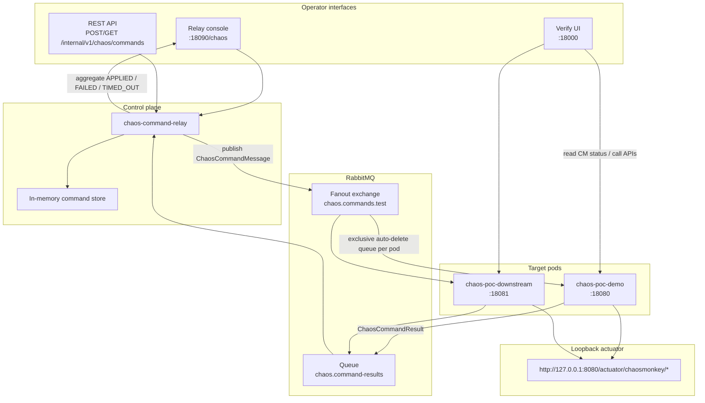
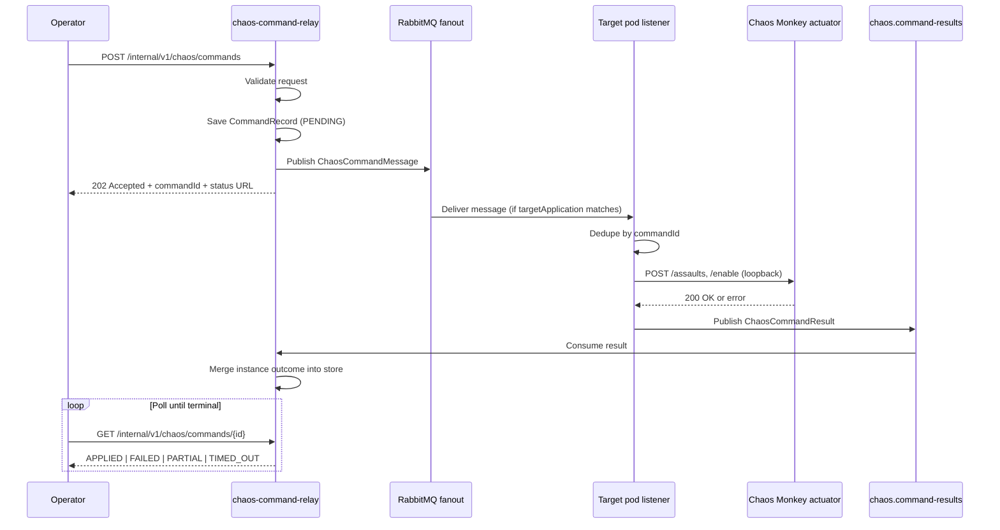
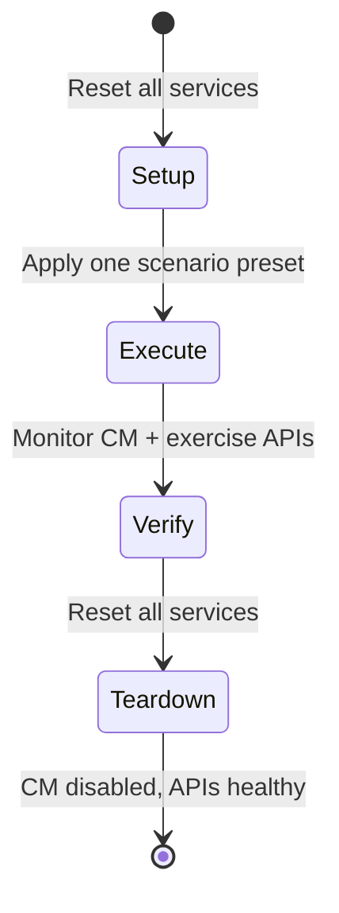

# Chaos Command Relay — High-Level Architecture (POC)

**Status:** Draft  
**Document type:** High-level architecture / design approach  
**Audience:** Platform engineers, SREs, and chaos-engineering stakeholders  
**Related work:** DSU-1671 Plan A  
**Repository:** [chaos-poc](../README.md)

---

## Executive summary

The Chaos Command Relay POC validates a **centralized chaos control plane** for SambaSafety microservices. Operators submit structured commands to a relay service; the relay fans out over RabbitMQ; each target pod applies Chaos Monkey configuration via **loopback** Spring Boot Actuator; and the relay aggregates per-instance outcomes into a pollable command status.

This document describes architecture, message contracts, configuration, and verification workflow. It distinguishes **validated POC patterns** from **production gaps** (auth, persistence, service discovery) so readers can plan DSU-1671 rollout without mistaking demo shortcuts for platform requirements.

---

## Goals and non-goals

### Goals

| ID | Goal | How the POC validates it |
| --- | --- | --- |
| G-1 | Centralize chaos command submission — operators do not curl actuators per pod | Relay REST API + operator console |
| G-2 | Fan out one command to every replica of a target application | RabbitMQ fanout + per-pod exclusive queues |
| G-3 | Apply assault configuration idempotently and report per-pod outcomes | `chaos-listener-lib` + `ChaosCommandResult` aggregation |
| G-4 | Separate control plane from application business logic | Relay and listener are independent modules |
| G-5 | Support repeatable, isolated test scenarios with rollback | `scenarios/` payloads + `verify-scenarios.sh` |

### Non-goals (explicit POC scope limits)

| ID | Non-goal | Production follow-up |
| --- | --- | --- |
| NG-1 | Okta / admin RBAC on relay APIs | DSU-1671 Plan A auth model |
| NG-2 | Durable command history (Postgres) | Replace in-memory `ConcurrentHashMap` store |
| NG-3 | Eureka or Kubernetes-based replica counting | `ExpectedInstancesResolver` static fallback today |
| NG-4 | Kubernetes deployment / multi-cluster fanout | Local Docker Compose only |
| NG-5 | Production profile assault enablement | Listener gated to `test` / `chaos-monkey` profiles |

---

## 1. Problem Statement

Chaos engineering on a microservice platform requires operators to configure Chaos Monkey assaults in a repeatable, auditable way; target specific applications and environments; observe whether every pod applied a command; and verify downstream behaviour under controlled fault injection.

Running Chaos Monkey manually per pod — SSH, port-forward, curl to actuator — does not scale and lacks aggregation. Embedding a full operator UI in every service couples chaos concerns to application code.

This POC separates responsibilities into three layers:

| Layer | Responsibility |
|-------|----------------|
| **Control plane** (`chaos-command-relay`) | Validate commands, publish to the bus, aggregate results, expose operator APIs and console |
| **Data plane listener** (`chaos-listener-lib`) | Embeddable library on each target pod; filter messages; apply via loopback actuator |
| **Verification surface** (`chaos-poc-ui`) | Monitor runtime CM state, exercise APIs, chart telemetry |

---

## 2. High-Level Architecture

This section defines component topology, command lifecycle, and design principles. Read it before message contracts (§4) or module-specific configuration (§5–§9).

### 2.1 Component Topology



The operator console and REST API share the same relay backend. The verify UI reads runtime Chaos Monkey (CM) state from target actuators but does **not** submit commands — control and observation stay separated.

### 2.2 Command Lifecycle Sequence



Polling continues until the relay reaches a terminal status (`APPLIED`, `FAILED`, or `TIMED_OUT`) or the operator abandons the run. `PARTIAL` indicates incomplete replica reporting within the timeout window — common when `expectedInstances` does not match live pod count.

### 2.3 Design Principles

1. **Fanout, not point-to-point routing.** Every listener binds an anonymous exclusive queue to a fanout exchange. Adding a new replica requires no relay reconfiguration — the pod self-registers by consuming messages.

2. **Application-level filtering on the consumer.** The relay publishes once; each pod ignores messages where `environment` or `targetApplication` does not match its local configuration. This avoids brittle routing keys per service.

3. **Loopback actuator only.** The listener calls `http://127.0.0.1:{port}/actuator/chaosmonkey/*` inside the pod network namespace. No cross-pod actuator traffic; no actuator credentials on the relay.

4. **Shared message contract in `chaos-listener-lib`.** `ChaosCommandMessage`, `ChaosCommandResult`, and `ChaosAssaultConfig` live in the library so relay and targets serialize identical JSON.

5. **Actuator as source of truth for runtime state.** The operator console probes `/status` and `/assaults` directly when reachable, rather than inferring CM state solely from the last command record.

---

## 3. Module Structure

The repository is a Maven multi-module project (Java 17, Spring Boot 3.0.9, Spring Cloud 2022.0.4, Chaos Monkey 3.1.0).

| Module | Artifact role |
|--------|---------------|
| `chaos-listener-lib` | Embeddable auto-configuration: Rabbit listener, actuator client, result publisher, message DTOs |
| `chaos-command-relay` | Standalone Spring Boot app: REST API, Rabbit topology, in-memory store, Thymeleaf operator console |
| `chaos-poc-demo` | Primary assault target: order flow, Feign gateways, real Chaos Monkey |
| `chaos-poc-downstream` | Mock inventory/auth dependency; second listener target for multi-service scenarios |
| `chaos-poc-ui` | React verify surface (Vite + Tailwind): CM monitor, API playground, live telemetry |

```
chaos-poc/
├── chaos-listener-lib/     # com.samba.chaos.listener.*
├── chaos-command-relay/    # com.samba.chaos.relay.*
├── chaos-poc-demo/         # com.samba.chaos.demo.*
├── chaos-poc-downstream/
├── chaos-poc-ui/
├── scenarios/              # JSON command payloads + manual test specs
├── docker-compose.yml
└── Dockerfile              # Multi-stage; target selects runtime image
```

---

## 4. Message Contract

Relay and listener share JSON DTOs from `chaos-listener-lib`. This section defines inbound commands, assault shape, per-pod results, and aggregate status semantics.

### 4.1 Inbound Command (`ChaosCommandMessage`)

Published by the relay to the fanout exchange `chaos.commands.test`.

| Field | Type | Constraints |
|-------|------|-------------|
| `commandId` | UUID | Assigned by relay if omitted on submit |
| `environment` | String | Must be `"test"` in this POC |
| `targetApplication` | String | Must match `spring.application.name` on consuming pods |
| `action` | Enum | `CONFIGURE`, `ENABLE`, `DISABLE`, `CONFIGURE_AND_ENABLE` |
| `assault` | Object | Required for `CONFIGURE` and `CONFIGURE_AND_ENABLE` |
| `expiresAt` | Instant | Required for `ENABLE` and `CONFIGURE_AND_ENABLE`; must be future |
| `issuedBy` | String | Audit label (operator id) |
| `correlationId` | String | Optional test-run identifier |

Example payload (`scenarios/bean-interceptor.json`):

```json
{
  "environment": "test",
  "targetApplication": "chaos-poc-demo",
  "action": "CONFIGURE_AND_ENABLE",
  "issuedBy": "poc-operator",
  "correlationId": "scenario-bean-interceptor",
  "expiresAt": "2026-12-31T23:59:59Z",
  "assault": {
    "level": 1,
    "deterministic": true,
    "latencyActive": false,
    "exceptionsActive": true,
    "watchedCustomServices": [
      "com.samba.chaos.demo.service.OrderService.placeOrder"
    ],
    "exception": {
      "type": "java.lang.RuntimeException",
      "method": "<init>",
      "arguments": [
        { "type": "java.lang.String", "value": "Chaos Monkey - RuntimeException" }
      ]
    }
  }
}
```

### 4.2 Assault Configuration (`ChaosAssaultConfig`)

| Field | Maps to CM actuator |
|-------|---------------------|
| `level` | Assault frequency (1–10000) |
| `deterministic` | When true with level 1, every matched call is assaulted |
| `latencyActive` / `exceptionsActive` | Toggle assault types |
| `latencyRangeStart` / `latencyRangeEnd` | Milliseconds |
| `watchedCustomServices` | Fully qualified `com.example.Service.method` entries |
| `exception` | JSON node: CM exception assault descriptor |

**Important:** `watchedCustomServices` requires the **fully qualified class name**. Short names like `OrderService.placeOrder` are not matched. For Feign clients, wrap the client in a `@Service` gateway bean (see `InventoryGateway`, `AuthorizationGateway` in the demo).

### 4.3 Outbound Result (`ChaosCommandResult`)

Published by each pod to queue `chaos.command-results`.

| Field | Description |
|-------|-------------|
| `commandId` | Correlates to the original command |
| `targetApplication` | Echo from message |
| `podName` | From `samba.chaos.command-listener.pod-name` (e.g. `HOSTNAME`) |
| `outcome` | `SUCCESS` or `ACTUATOR_ERROR` |
| `failedStep` | Actuator path that failed (`assaults`, `enable`, `disable`) |
| `httpStatus` | HTTP status from failed actuator call |
| `reportedAt` | Timestamp |

### 4.4 Aggregate Status

The relay computes command-level status from expected vs. reported instances:

| Status | Condition |
|--------|-----------|
| `PUBLISHED` | Immediately after accept (submit response only) |
| `PENDING` | Zero instance results received |
| `PARTIAL` | Some but not all expected instances reported |
| `APPLIED` | `successCount >= expectedInstances` |
| `FAILED` | Any instance reported `ACTUATOR_ERROR` |
| `TIMED_OUT` | `publishedAt + statusTimeoutSeconds` elapsed without full success |

---

## 5. Listener Library (`chaos-listener-lib`)

### 5.1 Activation Conditions

Auto-configuration loads when **all** of the following hold:

- Spring profile includes `test` or `chaos-monkey`
- `samba.chaos.command-listener.enabled=true`

```java
@AutoConfiguration
@Profile({"test", "chaos-monkey"})
@ConditionalOnProperty(prefix = "samba.chaos.command-listener", name = "enabled", havingValue = "true")
```

Production services would gate the listener behind the `test` profile (or a dedicated chaos profile) so assault machinery never activates in production profiles.

### 5.2 RabbitMQ Binding Model

Each pod creates a **non-durable, exclusive, auto-delete queue** bound to the fanout exchange:

```java
@RabbitListener(bindings = @QueueBinding(
    value = @Queue(value = "", durable = "false", exclusive = "true", autoDelete = "true"),
    exchange = @Exchange(name = "${samba.chaos.command-listener.commands-exchange}", type = "fanout")))
```

This pattern gives every replica an independent subscription without pre-provisioning queue names in the relay.

### 5.3 Message Filtering

Before applying, the listener checks:

1. `message.environment` equals local `samba.chaos.command-listener.environment` (default `test`)
2. `message.targetApplication` equals local application name (defaults from `spring.application.name`)
3. `expiresAt` is null or still in the future
4. `commandId` has not been processed on this pod (in-memory dedupe set)

### 5.4 Actuator Application Logic

`ChaosActuatorClient` translates command actions into CM REST calls against `actuator-base-url`:

| Action | Steps |
|--------|-------|
| `CONFIGURE` | Reset assaults → POST `/assaults` with config |
| `ENABLE` | POST `/enable` |
| `DISABLE` | Reset assaults → POST `/disable` |
| `CONFIGURE_AND_ENABLE` | Reset → configure → enable |

Reset-before-configure ensures stale watched services or exception types do not leak between scenarios.

Transient actuator failures (503, 504, connection errors) trigger Spring Retry with configurable backoff. Permanent HTTP errors fail fast and surface as `ACTUATOR_ERROR` on the result channel.

### 5.5 Property Aliasing and RabbitMQ Bridge

`ChaosListenerEnvironmentPostProcessor` runs at bootstrap to:

- Mirror legacy property prefixes (`chaos.listener.*`, `chaos.command-listener.*`) to canonical `samba.chaos.command-listener.*`
- Default `application-name` from `spring.application.name`
- Bridge `samba.chaos.command-listener.rabbitmq.*` into `spring.rabbitmq.*` when Spring Rabbit properties are absent

This lets host services configure chaos in service-owned YAML without duplicating Spring AMQP blocks.

---

## 6. Command Relay (`chaos-command-relay`)

### 6.1 REST API

| Method | Path | Response |
|--------|------|----------|
| `POST` | `/internal/v1/chaos/commands` | `202 Accepted` with `commandId` and poll URL, or `400` validation errors |
| `GET` | `/internal/v1/chaos/commands/{commandId}` | Aggregate status with per-pod instance list |

Validation rules (`ChaosCommandValidator`):

- Environment must be `test`
- `targetApplication` must appear in `chaos.relay.allowed-target-applications`
- Assault required for configure actions; expiry required for enable actions
- Latency range validated when `latencyActive=true`

### 6.2 RabbitMQ Topology

Declared in `RabbitConfig`:

- **Fanout exchange** `chaos.commands.test` (durable)
- **Queue** `chaos.command-results` (durable) — relay consumes aggregated pod results

Both sides use `Jackson2JsonMessageConverter` with shared `ChaosJsonMapper` for consistent serialization.

### 6.3 Instance Count Resolution

`ExpectedInstancesResolver` uses a static fallback map (`chaos.relay.expected-instances-fallback`) in the POC. Production Plan A would integrate Eureka or Kubernetes endpoints to count live replicas. Timeout semantics depend on this count: if expected is 3 but only 2 pods report success within the window, status becomes `TIMED_OUT` or `PARTIAL`.

### 6.4 Operator Console

Server-rendered Thymeleaf UI at `/chaos` provides:

- Service dashboard with CM state from **direct actuator probe** (`ChaosMonkeyActuatorProbe`)
- Scenario presets mapped to JSON payloads (DSUI reference commands + downstream variants)
- Per-service command history from the in-memory store
- **Reset CM configuration** (DISABLE command, wait for APPLIED) vs. **Clear demo data** (admin POST) — intentionally split
- **Reset all CM** on dashboard — disables assaults on every allowlisted target without clearing demo data

---

## 7. Demo Target Application

### 7.1 Service Topology

`chaos-poc-demo` simulates a simplified order service:

```
OrderController
    └── OrderService
            ├── InventoryGateway  → Feign → chaos-poc-downstream
            └── AuthorizationGateway → Feign → chaos-poc-downstream
```

Chaos assaults target `@Service` methods. Feign JDK proxies are not watched directly — gateways exist specifically so service-to-service latency and exception scenarios remain assaultable.

### 7.2 Exception → HTTP Status Mapping

Chaos Monkey throws Java exceptions; HTTP status is determined by `@ControllerAdvice` (`ApiExceptionHandler`):

| Assault exception | Demo mapping |
|-------------------|--------------|
| `ResourceNotFoundException` | 404 |
| `ForbiddenException` | 403 |
| `DuplicateOrderException` | 409 |
| `RuntimeException` | 500 (sanitized payload) |

Latency-only assaults on success paths preserve 200/201 responses while degrading timing — the preferred pattern for validating SLOs without triggering error-handling branches.

---

## 8. Verification UI (`chaos-poc-ui`)

The verify UI is deliberately **read-only with respect to chaos control**. Operators apply scenarios through the relay console; the verify UI confirms effect.

| Panel | Function |
|-------|----------|
| **Connection status** | Target reachability for demo or downstream |
| **Chaos Monkey state** | Polls `/actuator/chaosmonkey/status` and `/assaults` every 3s |
| **API playground** | Exercises create/submit/inventory endpoints |
| **Live telemetry** | Rolling latency chart, p50/p95, error rate, status distribution; optional repeating probe |

Environment variables at build time:

| Variable | Docker Compose value | Purpose |
|----------|---------------------|---------|
| `VITE_DEMO_URL` | `/api/demo` | Reverse-proxied demo API base |
| `VITE_OPERATOR_CONSOLE_URL` | `/operator/` | Link to relay console |

---

## 9. Configuration Reference

Property keys for the relay, embedding checklist for target services, and listener defaults. Docker profile overrides live in `application-docker.yml` on each module.

### 9.1 Relay (`chaos-command-relay/application.yml`)

```yaml
server:
  port: 8090

spring:
  application:
    name: chaos-command-relay
  rabbitmq:
    host: localhost
    port: 5672
    username: chaos
    password: chaos

chaos:
  relay:
    allowed-target-applications:
      - chaos-poc-demo
      - chaos-poc-downstream
    status-timeout-seconds: 30
    command-ttl-hours: 24
    expected-instances-fallback:
      chaos-poc-demo: 1
      chaos-poc-downstream: 1
    actuator-base-urls:
      chaos-poc-demo: http://localhost:18080/actuator/chaosmonkey
      chaos-poc-downstream: http://localhost:18081/actuator/chaosmonkey
    admin-base-urls:
      chaos-poc-demo: http://localhost:18080
      chaos-poc-downstream: http://localhost:18081
    verify-ui-url: http://localhost:18000
    rabbit:
      commands-exchange: chaos.commands.test
      results-queue: chaos.command-results

management:
  endpoints:
    web:
      exposure:
        include: health,info
```

Docker profile overrides hostnames (`application-docker.yml`) for container network DNS.

### 9.2 Target Service (embedding checklist)

```yaml
spring:
  profiles:
    active: test,chaos-monkey   # listener + CM profile

samba:
  chaos:
    command-listener:
      enabled: true
      pod-name: ${HOSTNAME:local}
      actuator-base-url: http://127.0.0.1:8080/actuator/chaosmonkey
      rabbitmq:
        host: ${RABBITMQ_HOST:localhost}
        port: 5672
        username: ${RABBITMQ_USER}
        password: ${RABBITMQ_PASSWORD}

chaos:
  monkey:
    enabled: false              # CM off until command ENABLE
    watcher:
      service: true
      restController: false
    assaults:
      level: 1

management:
  endpoints:
    web:
      exposure:
        include: health,chaosmonkey
  endpoint:
    chaosmonkey:
      enabled: true
```

**Host service dependencies** (not transitive from the library):

- `spring-boot-starter-actuator`
- `chaos-monkey-spring-boot`
- `chaos-listener-lib`

Add the service's `spring.application.name` to the relay allowlist.

### 9.3 Listener Property Defaults

| Property | Default |
|----------|---------|
| `samba.chaos.command-listener.environment` | `test` |
| `samba.chaos.command-listener.commands-exchange` | `chaos.commands.test` |
| `samba.chaos.command-listener.results-queue` | `chaos.command-results` |
| `samba.chaos.command-listener.max-apply-attempts` | `3` |
| `samba.chaos.command-listener.apply-backoff-ms` | `200` |
| `samba.chaos.command-listener.max-publish-attempts` | `3` |
| `samba.chaos.command-listener.publish-backoff-ms` | `100` |

---

## 10. Docker Compose Stack

```yaml
# Simplified service map
services:
  rabbitmq:              # :5672, management :15672 (chaos/chaos)
  chaos-poc-downstream:  # :18081 — mock dependency + listener
  chaos-poc-demo:        # :18080 — primary target + listener
  chaos-command-relay:   # :18090 — control plane
  chaos-poc-ui:          # :18000 — verify surface
```

All Java services build from a shared multi-stage `Dockerfile` with profile `docker,test,chaos-monkey` on targets. Health checks gate startup order: RabbitMQ → downstream → demo → relay → UI.

```bash
docker compose up --build -d
```

| URL | Purpose |
|-----|---------|
| http://localhost:18000 | Verify UI |
| http://localhost:18090/chaos | Operator console |
| http://localhost:18090/internal/v1/chaos/commands | Command API |
| http://localhost:15672 | RabbitMQ management |

---

## 11. Test Scenarios and Isolation Model

The `scenarios/` directory contains JSON payloads and Markdown test specifications. Each manual test follows a **transactional isolation model**:



| Scenario category | CM levers | Example file |
|-------------------|-----------|--------------|
| Bean interceptor | `watchedCustomServices` + `exceptionsActive` | `bean-interceptor.json` |
| Service-to-service | Gateway method + `latencyActive` | `service-to-service-latency.json` |
| High pressure | Wide latency range on hot path | `high-pressure-latency.json` |
| HTTP 4xx/5xx | Exception type mapped by `@ControllerAdvice` | `exception-http-404.json`, etc. |
| Disable / rollback | `action: DISABLE` | `disable.json` |

Automated verification:

```bash
./scenarios/tests/verify-scenarios.sh
```

The script runs each scenario in isolation with disable/reset bookends and asserts canonical actuator state after rollback.

---

## 12. Plan A Alignment (DSU-1671)

| Production concept (Plan A) | POC implementation |
|----------------------------|-------------------|
| Service-owned listener flag | `samba.chaos.command-listener.enabled` in target YAML |
| Profile-gated listener | `@Profile("test")` on auto-configuration |
| Relay command store | In-memory `ConcurrentHashMap` |
| Dashboard CM column | Actuator probe primary |
| Reset vs. clear data | Split: DISABLE vs. admin reset endpoint |
| Presets | Relay console + `scenarios/*.json` |
| Auth (Okta admin) | **Not implemented** |
| Postgres command history | **Not implemented** |
| Eureka instance counting | Static fallback map |

---

## 13. Security and Operational Notes

1. **No authentication on relay or actuator in the POC.** Production must enforce admin RBAC on command submission and restrict actuator exposure to loopback or authenticated sidecars.

2. **Chaos Monkey actuator is powerful.** The listener assumes loopback-only access. Never expose `/actuator/chaosmonkey` on a public ingress.

3. **Environment gate.** Commands require `environment: "test"`. Production rollout would add namespace or cluster identifiers and reject cross-environment fanout at validation time.

4. **Expiry enforcement.** Listeners ignore expired commands; relay validation requires future `expiresAt` for enable actions — limiting blast radius of forgotten assaults.

5. **PII.** Demo services use synthetic SKUs and order IDs. Real platform services must not log assault exception messages containing user data.

6. **Idempotency.** Per-pod `commandId` dedupe prevents double-application on redelivered messages; the relay merges results by `podName` when updating instance lists.

---

## 14. Local Development Without Docker

```bash
docker compose up -d rabbitmq
jenv shell 17 && mvn clean install

# Terminal A
cd chaos-poc-demo && mvn spring-boot:run

# Terminal B
cd chaos-command-relay && mvn spring-boot:run

curl -s -X POST http://localhost:8090/internal/v1/chaos/commands \
  -H 'Content-Type: application/json' \
  -d @scenarios/bean-interceptor.json
```

Verify UI hot reload:

```bash
cd chaos-poc-ui && npm install && npm run dev
# http://localhost:5173
```

---

## 15. Testing Strategy

| Layer | Approach |
|-------|----------|
| `chaos-listener-lib` | Unit tests: property aliasing, actuator client retry classification |
| `chaos-command-relay` | Unit tests: validator, status aggregation; integration test with Testcontainers RabbitMQ |
| Demo / downstream | Controller and exception handler tests |
| End-to-end | Docker Compose + manual UI specs + `verify-scenarios.sh` |

```bash
mvn test
mvn -pl chaos-command-relay test -Dtest=ChaosCommandRelayIntegrationTest
```

Integration tests skip automatically when Docker is unavailable.

---

## POC acceptance criteria

Criteria below are **testable** outcomes for this POC — not production SLOs.

| # | Criterion | Verification |
| --- | --- | --- |
| AC-1 | Relay accepts a valid command and returns `202` with `commandId` and poll URL | `POST /internal/v1/chaos/commands` + integration test |
| AC-2 | Fanout delivers messages only to pods whose `targetApplication` and `environment` match | Multi-service scenarios in `scenarios/tests/` |
| AC-3 | Each target pod applies assault config via loopback actuator (`127.0.0.1`) | `ChaosCommandResult.outcome = SUCCESS` on result queue |
| AC-4 | Relay aggregates instance results into `APPLIED`, `PARTIAL`, `FAILED`, or `TIMED_OUT` | `GET /internal/v1/chaos/commands/{id}` + unit tests on status aggregation |
| AC-5 | `DISABLE` restores canonical CM state (assaults off, APIs healthy) | `./scenarios/tests/verify-scenarios.sh` teardown assertions |
| AC-6 | Operator console probes actuator for live CM state (not only last command record) | Manual check at `http://localhost:18090/chaos` |
| AC-7 | Verify UI observes runtime behaviour without submitting chaos commands | `chaos-poc-ui` CM monitor + API playground |

---

## Open questions

| Question | Owner | Notes |
| --- | --- | --- |
| Which admin role may submit chaos commands in production? | Security / platform | POC has no auth on relay or actuator |
| Where should command history persist — shared Postgres vs. per-env store? | Platform | In-memory store is POC-only |
| How should `expectedInstances` resolve — Eureka, K8s endpoints, or service mesh? | Platform | Static fallback map in POC |
| Should listeners activate on a dedicated `chaos-monkey` profile only, or also `test`? | Service teams | Current: `@Profile({"test", "chaos-monkey"})` |
| How do we prevent cross-environment fanout if exchange names are shared? | Platform | POC validates `environment: "test"` gate only |

---

## 16. Summary

The Chaos Command Relay POC validates a **bus-mediated, actuator-driven chaos control plane** ready for production extension:

| Concern | POC outcome |
| --- | --- |
| **Orchestration** | Operators use one relay — not individual pod actuators |
| **Embedding** | Targets add a thin listener library behind profile + feature flag |
| **Fault injection** | Chaos Monkey remains the engine; the relay orchestrates its REST API at scale |
| **Verification** | Console controls assaults; verify UI observes runtime behaviour and SLO impact |

The architecture decouples chaos orchestration from application business logic, produces auditable command records (ready for durable storage), and supports multi-instance aggregation — the core requirements for safe, repeatable chaos engineering on the SambaSafety platform.

**Next steps:** resolve open questions above, implement DSU-1671 Plan A production gaps (auth, persistence, discovery), and pilot on a non-production namespace before broad rollout.

---

## Revision history

| Date | Summary |
| --- | --- |
| 2026-07-07 | Restructured per technical-documentation-authoring: metadata, goals/non-goals, acceptance criteria, open questions, diagram captions |
| (prior) | Initial architecture draft aligned to DSU-1671 Plan A and chaos-poc implementation |
