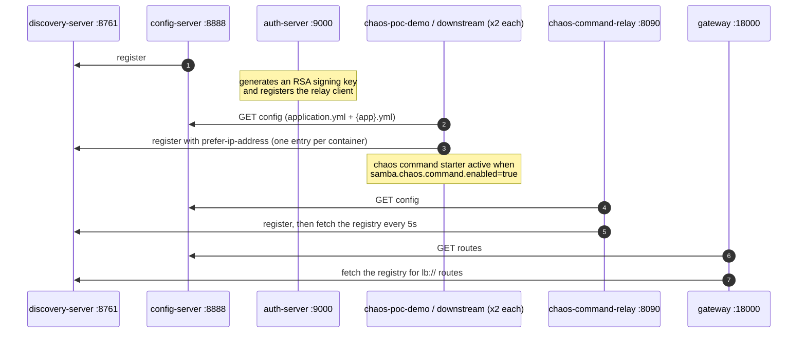
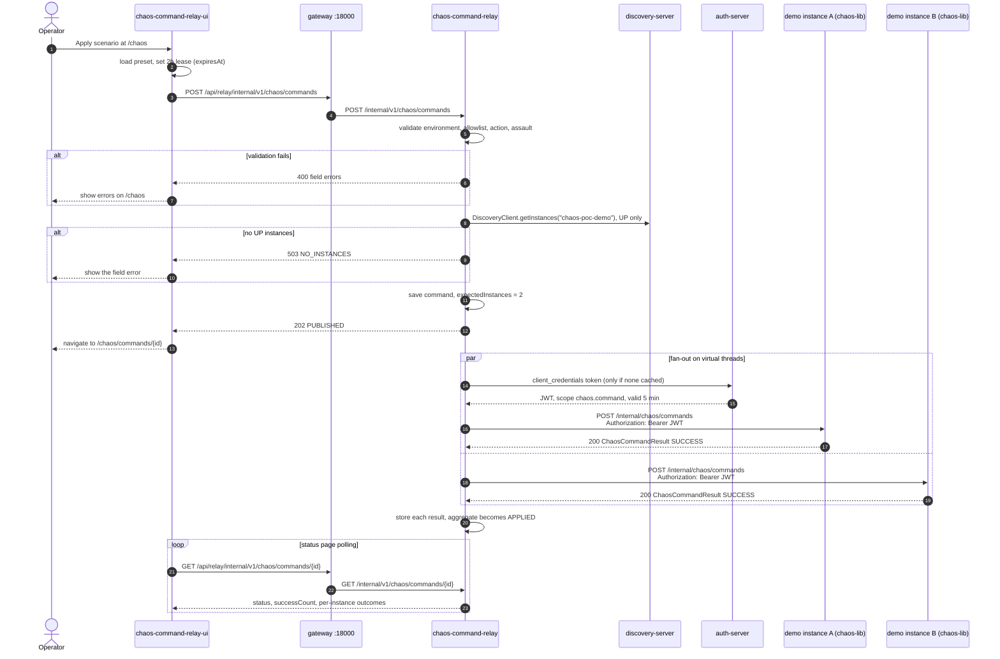
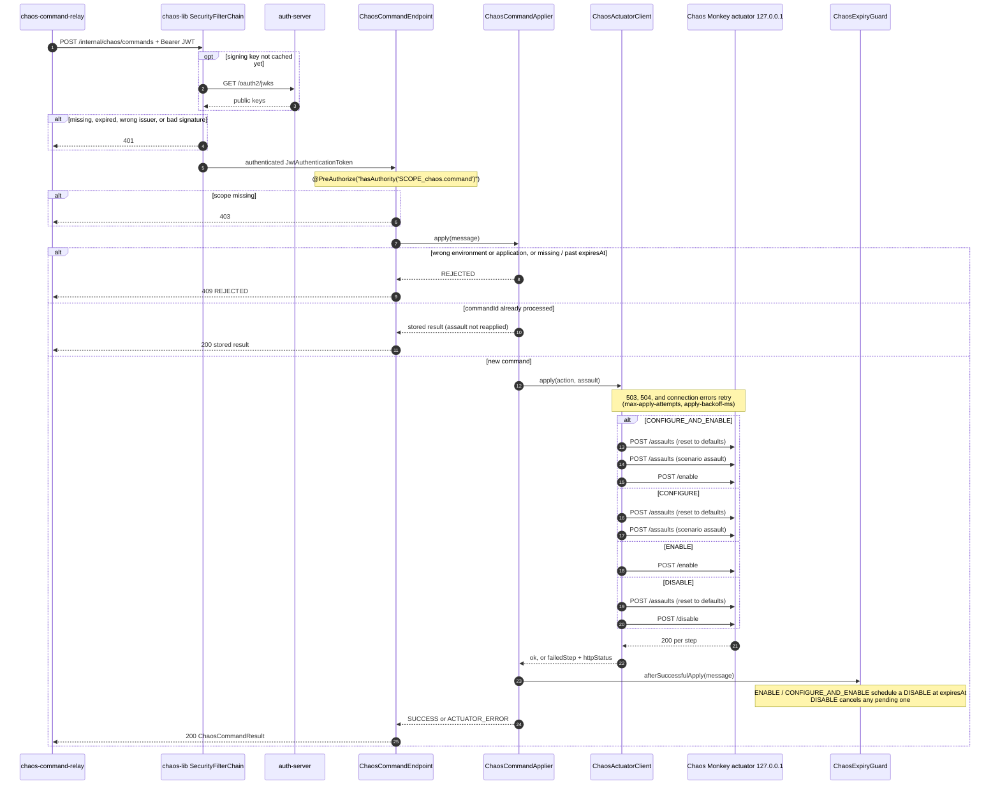
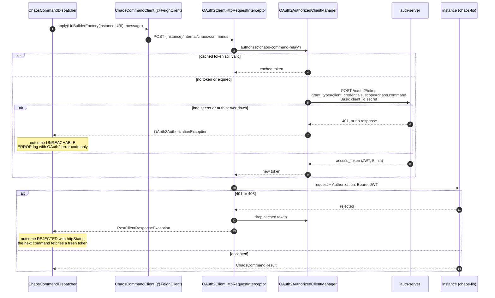
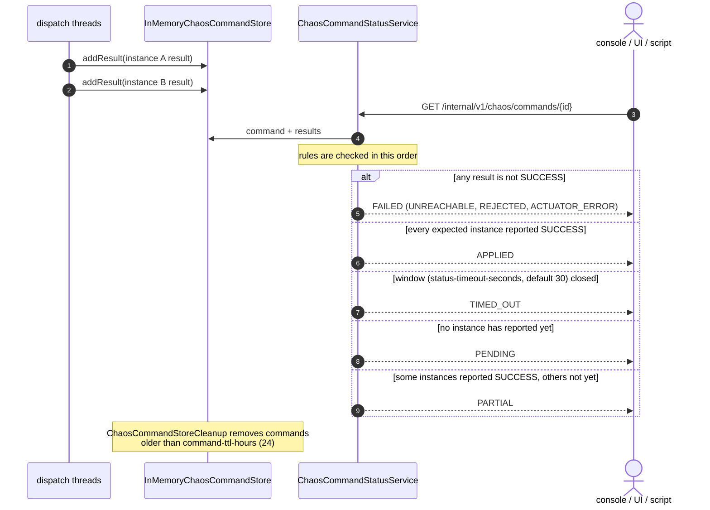
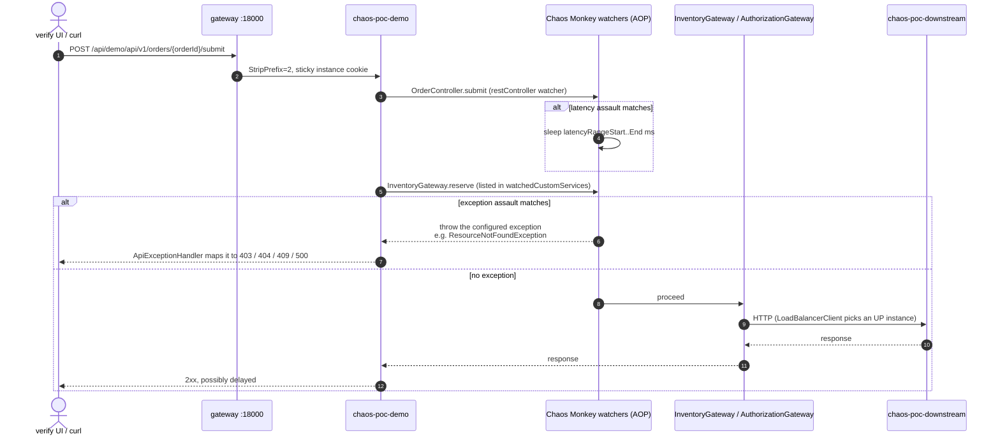
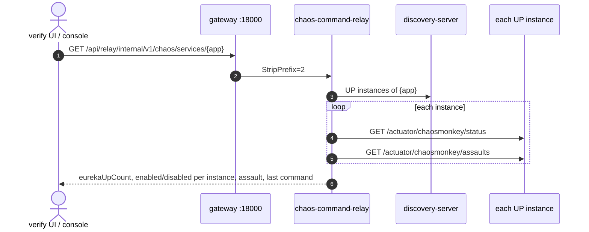
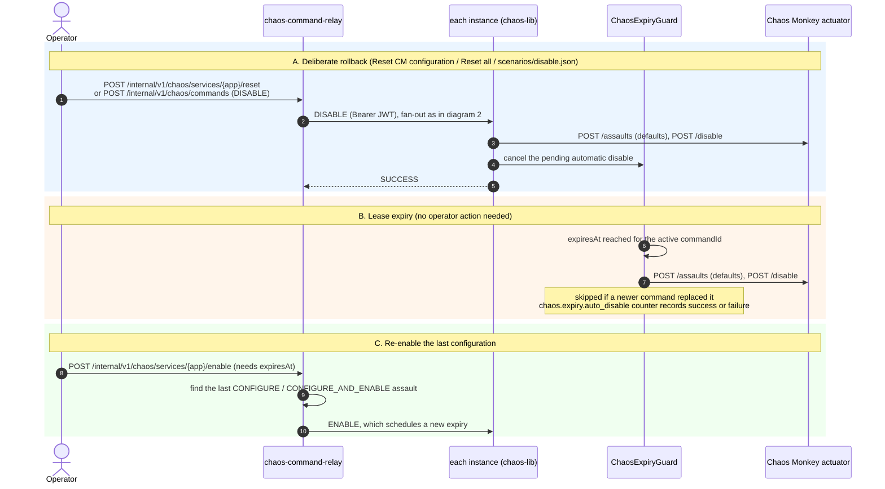
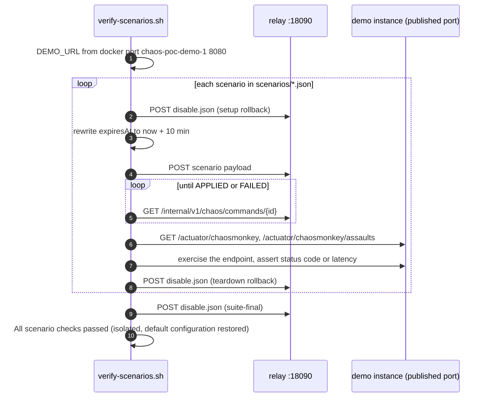

# Chaos Scenario Sequences

How a Chaos Monkey scenario travels from an operator to every instance of a target service, and how it is observed, expired, and rolled back. JSON request bodies sit under the diagrams that send them. The component view and the reset-to-default flow are in [ARCHITECTURE.md](ARCHITECTURE.md). Field rules and configuration are in [CHAOS_COMMAND_RELAY_APPROACH.md](CHAOS_COMMAND_RELAY_APPROACH.md).

| # | Diagram | Read it when you want to know… |
| --- | --- | --- |
| 1 | [Platform startup](#1-platform-startup) | what must be running before a command can be sent |
| 2 | [Apply a scenario (end to end)](#2-apply-a-scenario-end-to-end) | the full path of one command |
| 3 | [Inside one instance](#3-inside-one-instance-chaos-lib) | how chaos-lib authorizes and applies a command |
| 4 | [Access token lifecycle](#4-access-token-lifecycle) | when the relay calls the auth server |
| 5 | [Command status and aggregation](#5-command-status-and-aggregation) | how `APPLIED`, `FAILED`, and `TIMED_OUT` are decided |
| 6 | [Assault in action](#6-assault-in-action) | what happens to a real request while chaos is on |
| 7 | [Rollback and lease expiry](#7-rollback-and-lease-expiry) | how chaos is turned off, deliberately or automatically |
| 8 | [Automated scenario run](#8-automated-scenario-run) | what `verify-scenarios.sh` does |

Ports are the Compose defaults: gateway `18000`, relay `18090`, auth server `9000`, Eureka `8761`, config server `8888`.

## 1. Platform startup

Every Java service pulls its configuration from the config server and registers in Eureka. The auth server has no dependencies, so it starts on its own. Demo and downstream instances wait for it because chaos-lib validates tokens against its key set.



## 2. Apply a scenario (end to end)

An operator applies a preset from the Vue console (`/chaos`), or a client posts a command to the relay API. The console builds the JSON (including a two-hour lease) and posts it. Both go through `ChaosCommandService.submit`. The relay answers **202** straight away and pushes the command to each UP instance in parallel on virtual threads.



The same flow without the console, using `scenarios/*.json`:

```bash
curl -s -X POST http://localhost:18090/internal/v1/chaos/commands \
  -H 'Content-Type: application/json' -d @scenarios/bean-interceptor.json
curl -s http://localhost:18090/internal/v1/chaos/commands/{commandId}
```

`POST /internal/v1/chaos/commands` (gateway: `POST /api/relay/internal/v1/chaos/commands`). Omit `instanceSelection` to reach every UP instance. `commandId` is optional; the relay generates it. `environment` must be `test`. `expiresAt` is required for `ENABLE` and `CONFIGURE_AND_ENABLE`. `assault` is required for `CONFIGURE` and `CONFIGURE_AND_ENABLE`.

Every UP instance (`scenarios/latency-success-path.json`):

```json
{
  "environment": "test",
  "targetApplication": "chaos-poc-demo",
  "action": "CONFIGURE_AND_ENABLE",
  "issuedBy": "poc-operator",
  "correlationId": "scenario-latency-200-201",
  "expiresAt": "2026-12-31T23:59:59Z",
  "assault": {
    "level": 1,
    "deterministic": true,
    "latencyActive": true,
    "latencyRangeStart": 100,
    "latencyRangeEnd": 400,
    "exceptionsActive": false,
    "watchedCustomServices": ["com.samba.chaos.demo.web.OrderController.create"]
  }
}
```

One instance (`scenarios/partial-instances.json`). Replace `instanceIds` with a discovery id from `GET /internal/v1/chaos/services/chaos-poc-demo` (`upInstanceIds`). An id that is not UP is **400**. `expectedInstances` becomes the size of `instanceIds`.

```json
{
  "environment": "test",
  "targetApplication": "chaos-poc-demo",
  "action": "CONFIGURE_AND_ENABLE",
  "issuedBy": "poc-operator",
  "correlationId": "scenario-partial-instances",
  "expiresAt": "2026-12-31T23:59:59Z",
  "instanceSelection": "SOME",
  "instanceIds": ["chaos-poc-demo-1"],
  "assault": {
    "level": 1,
    "deterministic": true,
    "latencyActive": true,
    "latencyRangeStart": 100,
    "latencyRangeEnd": 400,
    "exceptionsActive": false,
    "watchedCustomServices": ["com.samba.chaos.demo.web.OrderController.create"]
  }
}
```

Turn assaults off (`scenarios/disable.json`). No `assault` and no `expiresAt`. This is `ALL` unless `instanceSelection` is set.

```json
{
  "environment": "test",
  "targetApplication": "chaos-poc-demo",
  "action": "DISABLE",
  "issuedBy": "poc-operator",
  "correlationId": "scenario-disable"
}
```

Exception assault (`scenarios/exception-http-404.json`). `exception` is the Chaos Monkey exception descriptor.

```json
{
  "environment": "test",
  "targetApplication": "chaos-poc-demo",
  "action": "CONFIGURE_AND_ENABLE",
  "issuedBy": "poc-operator",
  "correlationId": "scenario-http-404",
  "expiresAt": "2026-12-31T23:59:59Z",
  "assault": {
    "level": 1,
    "deterministic": true,
    "latencyActive": false,
    "exceptionsActive": true,
    "watchedCustomServices": ["com.samba.chaos.demo.service.InventoryGateway.getStock"],
    "exception": {
      "type": "com.samba.chaos.demo.exception.ResourceNotFoundException",
      "method": "<init>",
      "arguments": [{ "type": "java.lang.String", "value": "Inventory SKU not found" }]
    }
  }
}
```

## 3. Inside one instance (chaos-lib)

Spring Security runs before the controller. The starter filter chain only matches `/internal/chaos/**`, checks the JWT signature, expiry, and issuer, and requires scope `chaos.command`. The applier rejects commands meant for another environment or application, returns the stored result for a repeated `commandId`, and drives the Chaos Monkey actuator on loopback.



The relay posts this body to `{instance}/internal/chaos/commands`. It is the command above with the relay-assigned `commandId`. `instanceSelection` and `instanceIds` are not on this body; the relay already chose which instances to call.

```json
{
  "commandId": "7c9e6679-7425-40de-944b-e07fc1f90ae7",
  "environment": "test",
  "targetApplication": "chaos-poc-demo",
  "action": "CONFIGURE_AND_ENABLE",
  "issuedBy": "poc-operator",
  "correlationId": "scenario-latency-200-201",
  "expiresAt": "2026-12-31T23:59:59Z",
  "assault": {
    "level": 1,
    "deterministic": true,
    "latencyActive": true,
    "latencyRangeStart": 100,
    "latencyRangeEnd": 400,
    "exceptionsActive": false,
    "watchedCustomServices": ["com.samba.chaos.demo.web.OrderController.create"]
  }
}
```

The instance answers with `ChaosCommandResult`:

```json
{
  "commandId": "7c9e6679-7425-40de-944b-e07fc1f90ae7",
  "targetApplication": "chaos-poc-demo",
  "podName": "chaos-poc-demo-1",
  "outcome": "SUCCESS",
  "failedStep": null,
  "httpStatus": null,
  "reportedAt": "2026-10-06T18:00:01Z"
}
```

`outcome` is `SUCCESS`, `ACTUATOR_ERROR`, or `REJECTED`. The relay records `UNREACHABLE` itself when the call never completes.

## 4. Access token lifecycle

The relay authenticates as the OAuth2 client `chaos-command-relay` and caches one token for all instances. Dispatch threads have no operator security context, so the token is requested for a fixed relay principal.



## 5. Command status and aggregation

Results are stored as they arrive. The aggregate status is calculated each time someone reads it. `expectedInstances` is the selected set: `ALL` is every UP instance, and `SOME` is the named discovery ids. A SOME command can be `APPLIED` while other replicas were never called.



`GET /internal/v1/chaos/commands/{commandId}` has no body. A SOME command that landed on one of two instances looks like this:

```json
{
  "commandId": "7c9e6679-7425-40de-944b-e07fc1f90ae7",
  "status": "APPLIED",
  "targetApplication": "chaos-poc-demo",
  "action": "CONFIGURE_AND_ENABLE",
  "expectedInstances": 1,
  "successCount": 1,
  "failureCount": 0,
  "instanceSelection": "SOME",
  "instanceIds": ["chaos-poc-demo-1"],
  "instances": [
    {
      "podName": "chaos-poc-demo-1",
      "outcome": "SUCCESS",
      "reportedAt": "2026-10-06T18:00:01Z",
      "failedStep": null,
      "httpStatus": 200
    }
  ]
}
```

## 6. Assault in action

Once Chaos Monkey is enabled on an instance, its AOP watchers intercept matching beans. The verify UI and the scenario scripts use this to show the configured effect. The gateway uses sticky sessions, so one browser keeps hitting the same demo instance.



Which bean is hit, and how, comes from the scenario's `assault` block. For example, `exception-http-404.json` watches `InventoryGateway.getStock` and throws `ResourceNotFoundException`.

The verify UI sends `POST /api/demo/api/v1/orders` (the gateway strips `/api/demo`):

```json
{ "sku": "sku-1", "quantity": 1 }
```

`POST /api/demo/api/v1/orders/{orderId}/submit` has no body.

To show the current state, the relay asks each instance's actuator directly:



## 7. Rollback and lease expiry

There are three ways to turn chaos off. All of them end in a `DISABLE` on each instance. That call first resets assaults to their defaults and then disables Chaos Monkey.



The guard lives in each instance's memory. If an instance restarts, Chaos Monkey starts disabled again (`chaos.monkey.enabled: false`), so no assault survives the restart.

Reset and disable use `POST /internal/v1/chaos/services/{applicationName}/reset` (or `/disable`). `expiresAt` is ignored. Reset waits until the aggregate is terminal; disable returns **202** immediately. Both omit `instanceSelection`, so they reach every UP instance.

```json
{ "issuedBy": "chaos-console", "correlationId": "console-reset" }
```

Re-enable uses `POST /internal/v1/chaos/services/{applicationName}/enable`. `expiresAt` is required. The relay replays the last applied `CONFIGURE` or `CONFIGURE_AND_ENABLE` assault.

```json
{
  "issuedBy": "chaos-console",
  "correlationId": "console-enable",
  "expiresAt": "2026-10-06T20:00:00Z"
}
```

## 8. Automated scenario run

`./scenarios/tests/verify-scenarios.sh` runs every payload in isolation and always rolls back to the default configuration, even when a check fails.


